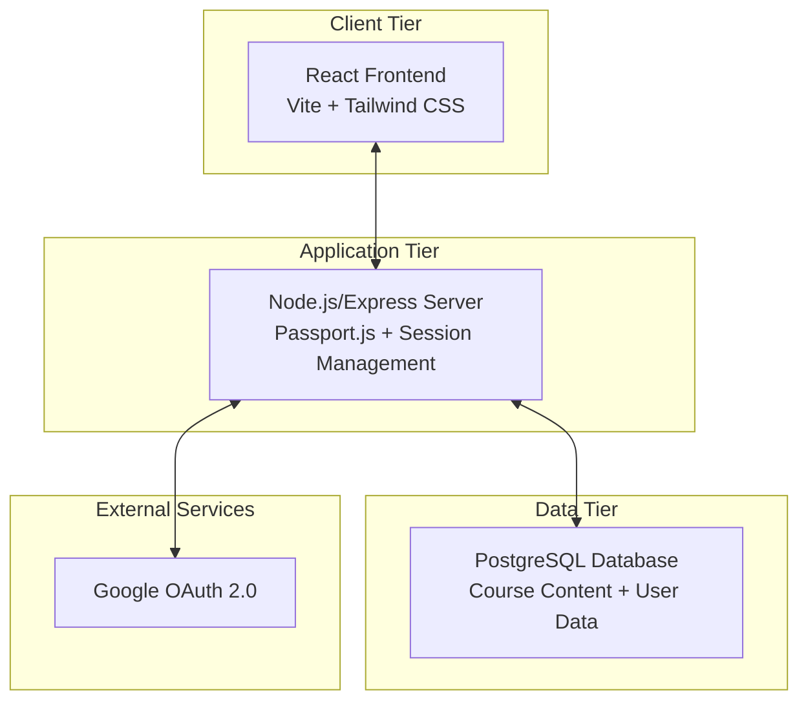
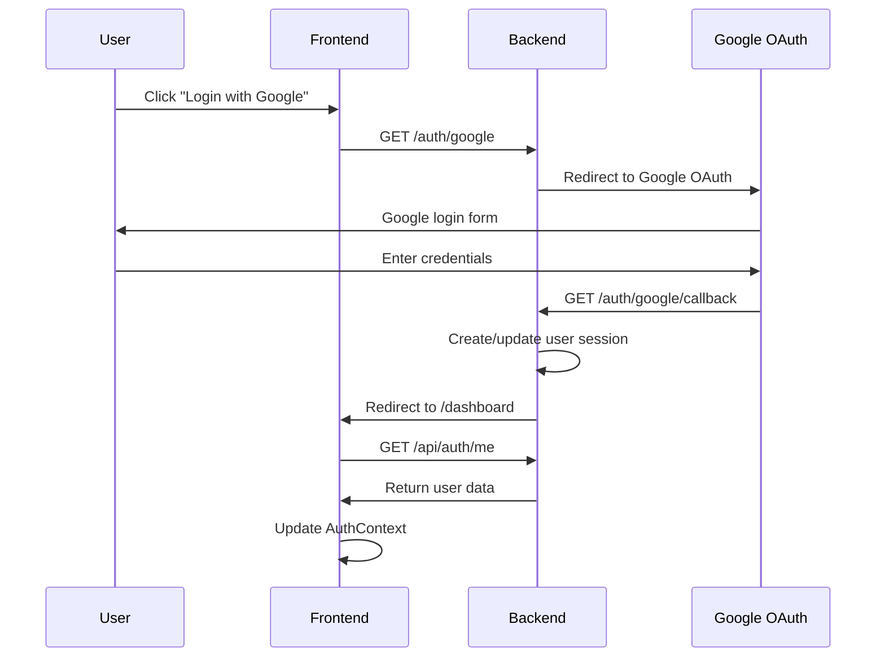

# Design Document

## Overview

The ML Engineer Course Learning Platform is a full-stack web application built with a modern technology stack. The system follows a three-tier architecture with a React frontend, Node.js/Express backend, and PostgreSQL database. The application uses Google OAuth 2.0 for authentication and implements a comprehensive learning management system with progress tracking, interactive quizzes, and project submissions.

## Architecture

### High-Level Architecture



### Monorepo Structure

```
/
├── package.json (root - concurrency scripts)
├── client/
│   ├── src/
│   │   ├── components/
│   │   ├── pages/
│   │   ├── context/
│   │   └── utils/
│   ├── package.json
│   └── vite.config.js
├── server/
│   ├── routes/          # Route definitions and endpoint mapping
│   ├── controllers/     # Business logic and request handling
│   ├── resources/       # Input validation and data transformation
│   ├── middleware/      # Authentication and request processing
│   ├── config/          # Database and application configuration
│   ├── package.json
│   └── server.js
└── database/
    ├── schema.sql
    └── seed.sql
```

## Components and Interfaces

### Frontend Components

#### Core Components
- **App.js**: Main application component with routing setup
- **AuthContext.js**: Authentication state management using React Context
- **ProtectedRoute.js**: Route wrapper for authenticated access
- **Navbar.js**: Navigation with user info and logout functionality

#### Page Components
- **LoginPage.js**: Landing page with Google OAuth login
- **DashboardPage.js**: Module overview with progress indicators
- **ModulePage.js**: Individual module content and navigation

#### Feature Components
- **CheckpointComponent.js**: Displays checkpoint content and embedded quizzes
- **QuizComponent.js**: Interactive quiz interface with immediate feedback and visual indicators
- **AnswerOption.js**: Individual answer choice with selection handling and disabled state
- **ProjectSubmissionComponent.js**: GitHub URL submission form with validation and confirmation
- **ProgressIndicator.js**: Visual progress markers for modules and completion status

### Backend API Structure

The backend follows a three-layer architecture pattern:

#### Routes Layer (`/routes`)
Route definitions that map HTTP endpoints to controller methods:

- **auth.js** - Authentication route mappings
  - `GET /auth/google` - Maps to AuthController.initiateGoogleAuth
  - `GET /auth/google/callback` - Maps to AuthController.handleGoogleCallback
  - `GET /api/auth/me` - Maps to AuthController.getCurrentUser
  - `POST /api/auth/logout` - Maps to AuthController.logout

- **course.js** - Course content route mappings
  - `GET /api/course/all` - Maps to CourseController.getAllCourseContent

- **quiz.js** - Quiz interaction route mappings
  - `POST /api/quiz/submit/:answerId` - Maps to QuizController.submitAnswer

- **progress.js** - User progress route mappings
  - `GET /api/user/progress` - Maps to ProgressController.getUserProgress
  - `POST /api/progress/module/:moduleId` - Maps to ProgressController.markModuleComplete
  - `POST /api/project/module/:moduleId` - Maps to ProjectController.submitProject

#### Controllers Layer (`/controllers`)
Business logic and request handling:

- **AuthController.js** - Authentication business logic
- **CourseController.js** - Course content retrieval logic
- **QuizController.js** - Quiz submission and validation logic
- **ProgressController.js** - Progress tracking business logic
- **ProjectController.js** - Project submission business logic

#### Resources Layer (`/resources`)
Input validation and data transformation:

- **AuthResource.js** - Authentication request validation
- **QuizResource.js** - Quiz submission validation
- **ProgressResource.js** - Progress update validation
- **ProjectResource.js** - GitHub URL validation and project submission validation

### Authentication Flow



## Data Models

### Database Schema

#### Users Table
```sql
CREATE TABLE users (
    id SERIAL PRIMARY KEY,
    google_id TEXT UNIQUE NOT NULL,
    email TEXT UNIQUE NOT NULL,
    display_name TEXT,
    created_at TIMESTAMPTZ DEFAULT NOW()
);
```

#### Course Content Tables
```sql
CREATE TABLE modules (
    id SERIAL PRIMARY KEY,
    module_number INT NOT NULL,
    title TEXT NOT NULL,
    philosophy TEXT,
    description TEXT
);

CREATE TABLE checkpoints (
    id SERIAL PRIMARY KEY,
    module_id INT REFERENCES modules(id) ON DELETE CASCADE,
    checkpoint_number FLOAT NOT NULL,
    title TEXT NOT NULL,
    content TEXT NOT NULL
);

CREATE TABLE questions (
    id SERIAL PRIMARY KEY,
    checkpoint_id INT REFERENCES checkpoints(id) ON DELETE CASCADE,
    question_text TEXT NOT NULL,
    scenario TEXT NOT NULL
);

CREATE TABLE answers (
    id SERIAL PRIMARY KEY,
    question_id INT REFERENCES questions(id) ON DELETE CASCADE,
    answer_text TEXT NOT NULL,
    is_correct BOOLEAN NOT NULL,
    explanation TEXT NOT NULL
);
```

#### User Progress Tables
```sql
CREATE TABLE user_module_progress (
    id SERIAL PRIMARY KEY,
    user_id INT REFERENCES users(id) ON DELETE CASCADE,
    module_id INT REFERENCES modules(id) ON DELETE CASCADE,
    is_completed BOOLEAN DEFAULT FALSE,
    UNIQUE(user_id, module_id)
);

CREATE TABLE user_projects (
    id SERIAL PRIMARY KEY,
    user_id INT REFERENCES users(id) ON DELETE CASCADE,
    module_id INT REFERENCES modules(id) ON DELETE CASCADE,
    github_url TEXT NOT NULL,
    UNIQUE(user_id, module_id)
);
```

### API Data Formats

#### Course Content Response
```json
[
  {
    "id": 1,
    "module_number": 0,
    "title": "Module 0: Introduction to ML",
    "philosophy": "Understanding the fundamentals...",
    "checkpoints": [
      {
        "id": 1,
        "checkpoint_number": 0.1,
        "title": "What is Machine Learning?",
        "content": "Machine learning is...",
        "questions": [
          {
            "id": 1,
            "question_text": "Which best describes supervised learning?",
            "scenario": "You're building a spam filter...",
            "answers": [
              {
                "id": 1,
                "answer_text": "Learning with labeled examples",
                "explanation": "Correct. Supervised learning..."
              }
            ]
          }
        ]
      }
    ]
  }
]
```

#### Quiz Response Format
```json
{
  "correct": true,
  "explanation": "Correct. The median finds the middle value..."
}
```

#### User Progress Response Format
```json
{
  "progress": [
    {
      "module_id": 1,
      "is_completed": true
    }
  ],
  "projects": [
    {
      "module_id": 1,
      "github_url": "https://github.com/user/project"
    }
  ]
}
```

## Error Handling

### Frontend Error Handling
- **Authentication Errors**: Redirect to login page with error message display
- **API Errors**: Display user-friendly error messages with retry options
- **Network Errors**: Show offline indicators and retry mechanisms
- **Form Validation**: Real-time validation with clear error messaging for project submissions
- **Quiz Errors**: Handle submission failures with appropriate user feedback

### Backend Error Handling
- **Authentication Middleware**: Return 401 for unauthenticated requests with redirect to login
- **Database Errors**: Log errors and return appropriate HTTP status codes
- **Validation Errors**: Return 400 with detailed error messages for project URL validation
- **Server Errors**: Return 500 with generic error message (log details)
- **Duplicate Submission Handling**: Proper UPSERT logic for project resubmissions

### Error Response Format
```json
{
  "error": true,
  "message": "User-friendly error message",
  "code": "ERROR_CODE",
  "details": {} // Optional additional context
}
```

## Testing Strategy

### Frontend Testing
- **Unit Tests**: Component testing with React Testing Library
- **Integration Tests**: User flow testing with realistic data
- **E2E Tests**: Critical path testing (login, quiz completion, progress tracking)

### Backend Testing
- **Unit Tests**: Individual route and middleware testing
- **Integration Tests**: Database interaction testing
- **API Tests**: Endpoint testing with various scenarios

### Database Testing
- **Schema Validation**: Ensure constraints and relationships work correctly
- **Data Integrity**: Test cascading deletes and unique constraints
- **Performance Testing**: Query optimization for course content loading

### Security Considerations

#### Authentication Security
- Secure session management with HttpOnly cookies and PostgreSQL session storage
- CSRF protection for state-changing operations
- Proper OAuth 2.0 implementation with secure redirect URIs
- Session persistence across browser sessions for user convenience

#### Data Protection
- Input validation and sanitization
- SQL injection prevention using parameterized queries
- XSS protection through proper content rendering

#### Environment Security
- Environment variables for sensitive configuration
- Secure database connection strings
- HTTPS enforcement in production

## Performance Optimizations

### Frontend Optimizations
- **Code Splitting**: Route-based code splitting with React.lazy
- **Caching**: Browser caching for static assets
- **Lazy Loading**: Progressive loading of course content
- **State Management**: Efficient React state updates

### Backend Optimizations
- **Database Indexing**: Proper indexes on frequently queried columns
- **Connection Pooling**: PostgreSQL connection pool management
- **Caching**: Session storage optimization
- **Query Optimization**: Single query for complete course data

### Database Design Optimizations
- **Normalized Schema**: Proper normalization to reduce redundancy
- **Efficient Queries**: Single API call optimization for complete course data with JOIN operations
- **Indexing Strategy**: Indexes on foreign keys and frequently searched columns
- **Unique Constraints**: Prevention of duplicate progress records and project submissions
- **Referential Integrity**: Proper foreign key constraints with cascading deletes

## Design Decisions and Rationales

### Single API Call for Course Content
**Decision**: Load all course content (modules, checkpoints, questions, answers) in a single API call rather than lazy loading individual components.

**Rationale**: This approach reduces network overhead and provides a smoother user experience when navigating between checkpoints. Given that the course content is relatively static and not extremely large, the benefits of reduced API calls outweigh the slightly larger initial payload.

### PostgreSQL Session Storage
**Decision**: Store user sessions in PostgreSQL rather than using in-memory or Redis storage.

**Rationale**: This ensures session persistence across server restarts and provides a simpler deployment architecture. Since the application doesn't require extremely high-frequency session access, PostgreSQL provides adequate performance while maintaining data consistency.

### Immediate Quiz Feedback
**Decision**: Provide immediate feedback after each quiz answer submission rather than waiting for complete quiz completion.

**Rationale**: This design enhances the learning experience by providing instant validation and explanations, helping users understand concepts immediately rather than waiting until the end of a quiz section.

### UPSERT Logic for Project Submissions
**Decision**: Allow users to update existing project submissions rather than preventing resubmissions.

**Rationale**: Students may need to update their project URLs as they improve their work or fix issues. The UPSERT approach provides flexibility while maintaining the one-project-per-module constraint.

### Monorepo Structure
**Decision**: Organize the codebase as a monorepo with separate client and server directories.

**Rationale**: This structure simplifies development workflow, enables shared configuration, and makes it easier to run both frontend and backend concurrently during development while maintaining clear separation of concerns.

### Three-Layer Backend Architecture
**Decision**: Implement a routes-controllers-resources architecture pattern for the backend API.

**Rationale**: This separation of concerns provides several benefits:
- **Routes**: Clean endpoint definitions that are easy to understand and maintain
- **Controllers**: Centralized business logic that can be easily tested and reused
- **Resources**: Consistent input validation and data transformation across all endpoints
- **Maintainability**: Clear separation makes the codebase easier to navigate and modify
- **Testability**: Each layer can be unit tested independently
- **Scalability**: New features can be added following the established pattern